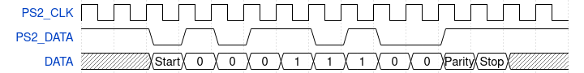

# PS/2 Controller

- [PS/2 Controller](#ps2-controller)
  - [Features](#features)
  - [PS2 protocol Basics](#ps2-protocol-basics)
    - [Overview](#overview)
    - [Interface Pins](#interface-pins)
    - [Data Frame Format](#data-frame-format)
  - [Implementation](#implementation)
    - [Interface](#interface)
    - [State Machine](#state-machine)
  - [Reference](#reference)


A Verilog-based PS/2 keyboard interface controller designed for FPGA applications. This module allows for decoding PS/2
keyboard inputs into usable scan codes for integration into embedded systems, custom CPUs, or educational projects such
as Nand2Tetris.

## Features

- Supports standard PS/2 keyboard communication
- Fully synchronous design
- Captures key make and break codes
- Optional FIFO buffer for scan code storage
- Handles signal debouncing and glitch filtering

## PS2 protocol Basics

### Overview

The PS/2 protocol transmits serial data from the keyboard to the host (FPGA). This controller handles the 11-bit serial data frame including:

- Start bit
- 8 data bits (LSB first)
- Parity bit (odd)
- Stop bit

### Interface Pins

- `PS2_CLK` (Clock): Driven by the keyboard. It tells the host when to read the data line.
- `PS2_DATA` (Data): Serial data from the keyboard.

### Data Frame Format

Each key press or release sends an 11-bit serial frame over the data line:

```
| Start | 8 Data Bits | Parity | Stop |
| ----- | ----------- | ------ | ---- |
| 0     | D0 to D7    | P      | 1    |
```

- Start bit: Always 0
- Data bits: 8 bits (Least Significant Bit first)
- Parity bit: Odd parity (total number of 1s including data and parity should be odd)
- Stop bit: Always 1



## Implementation

### Interface

| Signal     | Direction | Width | Description                             |
| ---------- | --------- | ----- | --------------------------------------- |
| clk        | Input     | 1     | System clock                            |
| rst_n      | Input     | 1     | Active-low synchronous reset            |
| ps2_clk    | Input     | 1     | PS/2 clock line from device             |
| ps2_data   | Input     | 1     | PS/2 data line from device              |
| valid      | Output    | 1     | High when a valid scan code is received |
| scan_code  | Output    | 8     | Received 8-bit scan code                |
| parity_err | Output    | 1     | High if odd parity check fails          |
| frame_err  | Output    | 1     | High if stop bit is incorrect (not 1)   |

### State Machine

The logic of PS/2 controller is very simple and it is implemented using a state machine.

| State  | Code | Description                                  |
| ------ | ---- | -------------------------------------------- |
| IDLE   | 0    | Waits for start bit (falling edge, data = 0) |
| DATA   | 1-8  | Receives 8 bits of scan code (LSB first)     |
| PARITY | 9    | Receives the parity bit                      |
| STOP   | 10   | Checks stop bit and finalizes output         |

## Reference

- PS2: <https://www-ug.eecg.toronto.edu/msl/nios_devices/datasheets/PS2%20Keyboard%20Protocol.htm>
- Scan Code: <https://www.vetra.com/scancodes.html>